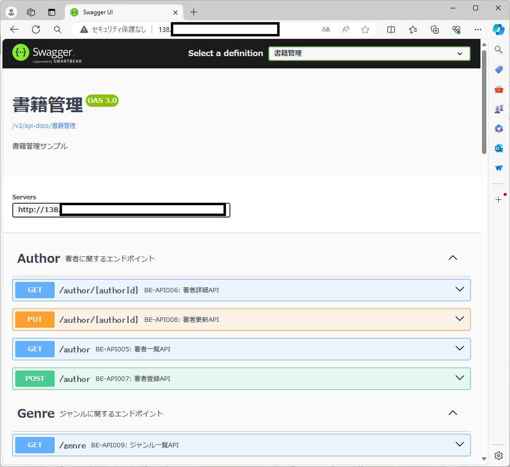
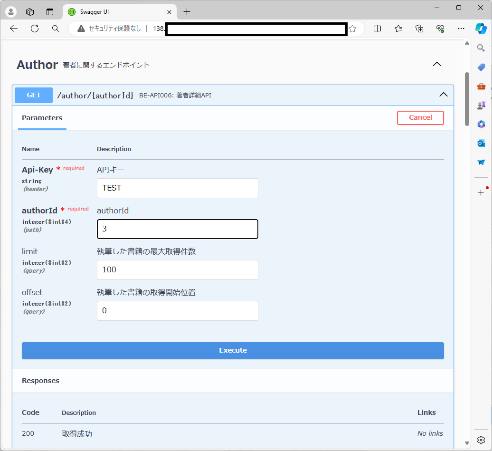
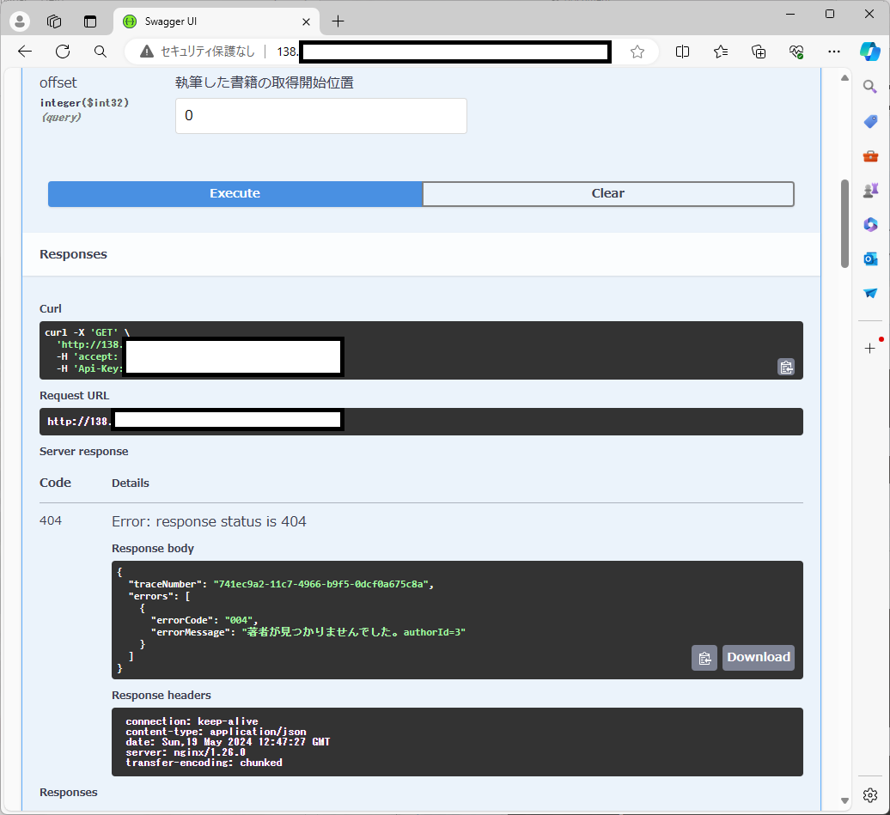
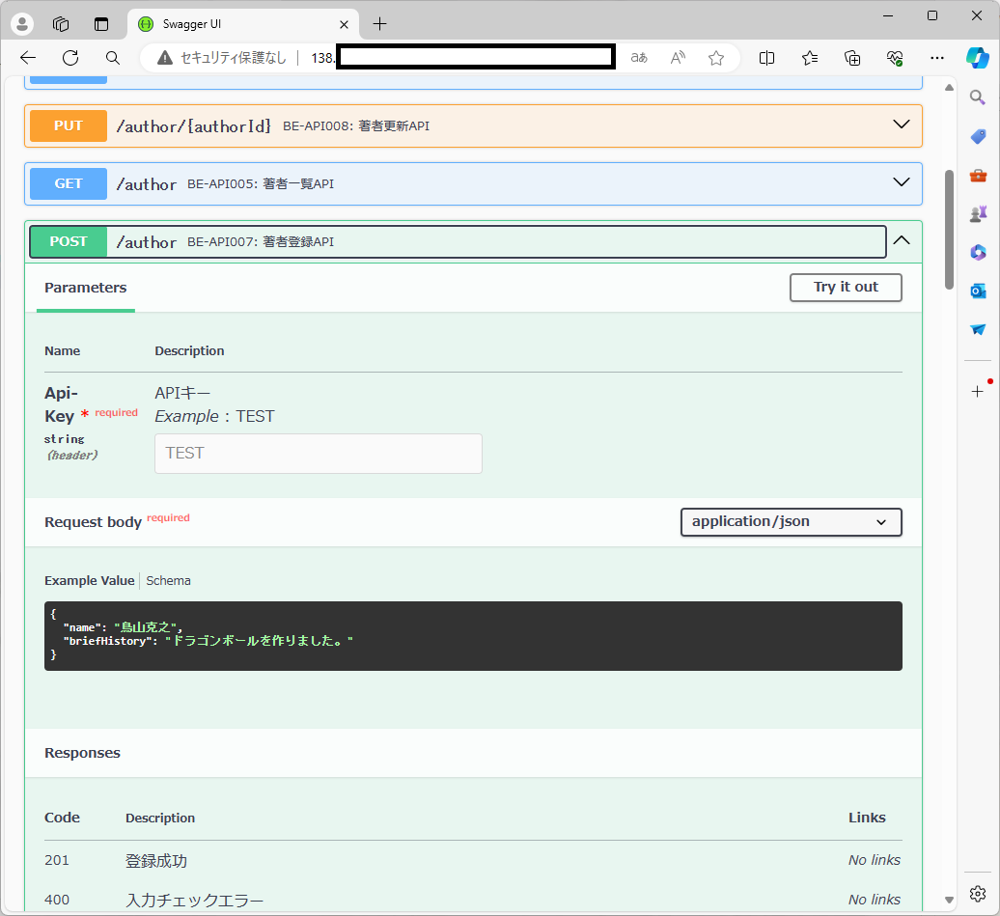
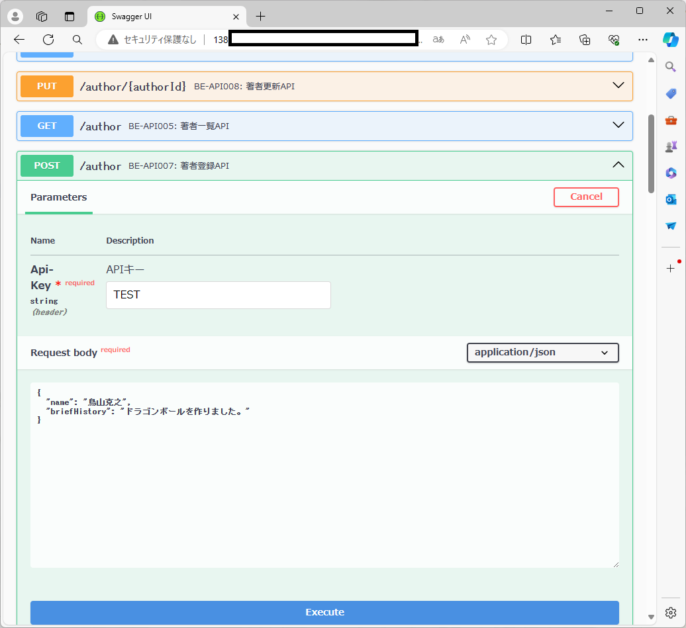
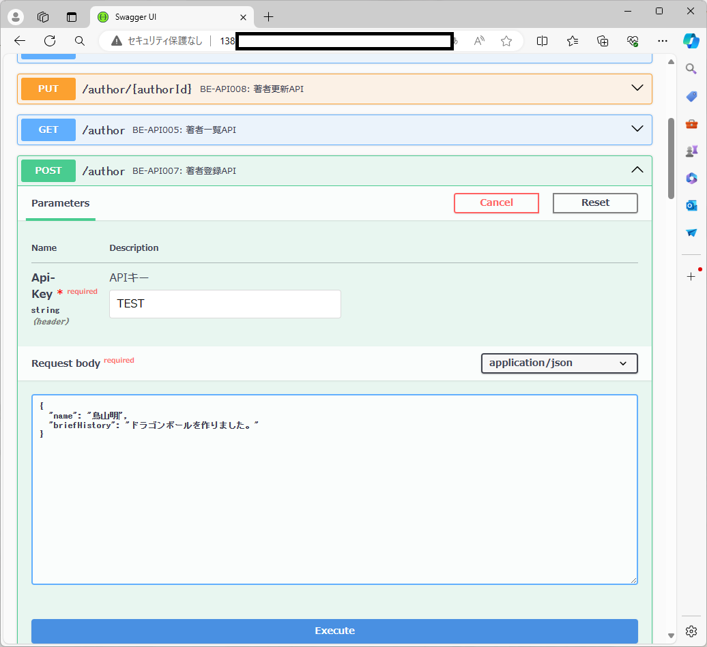
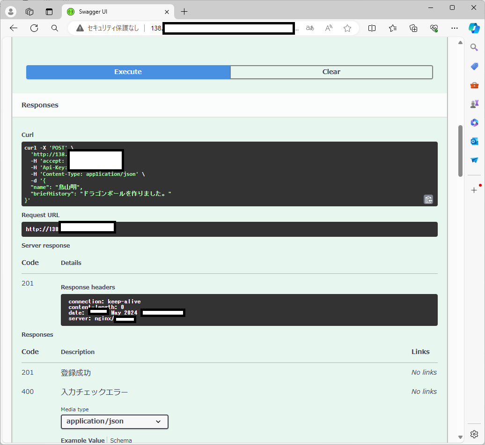
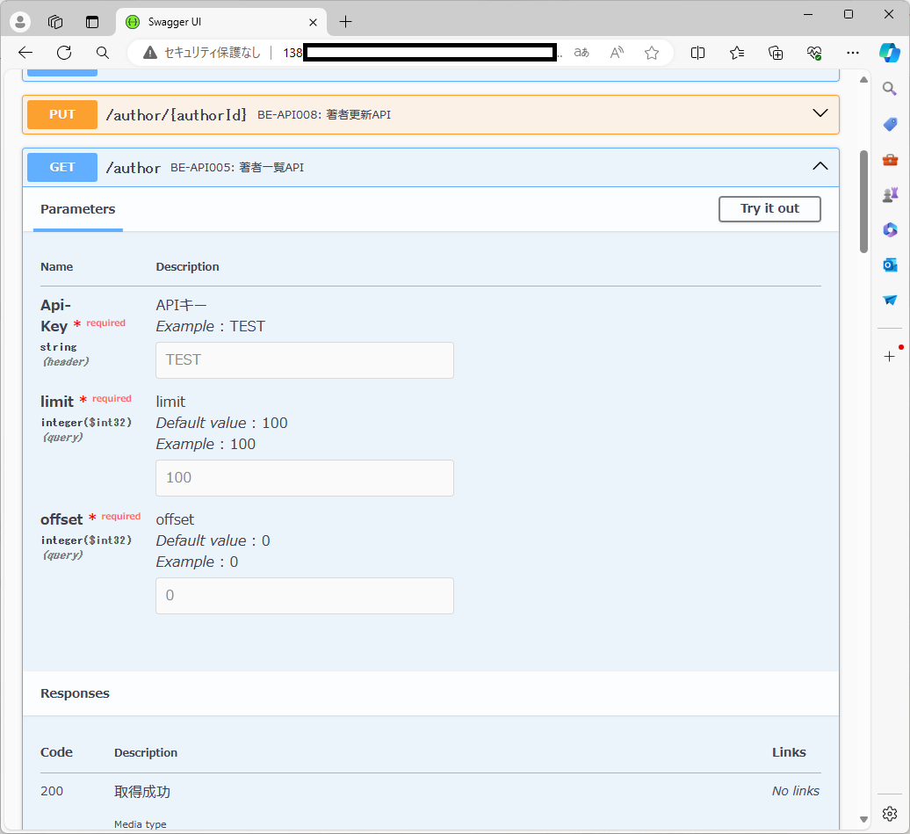
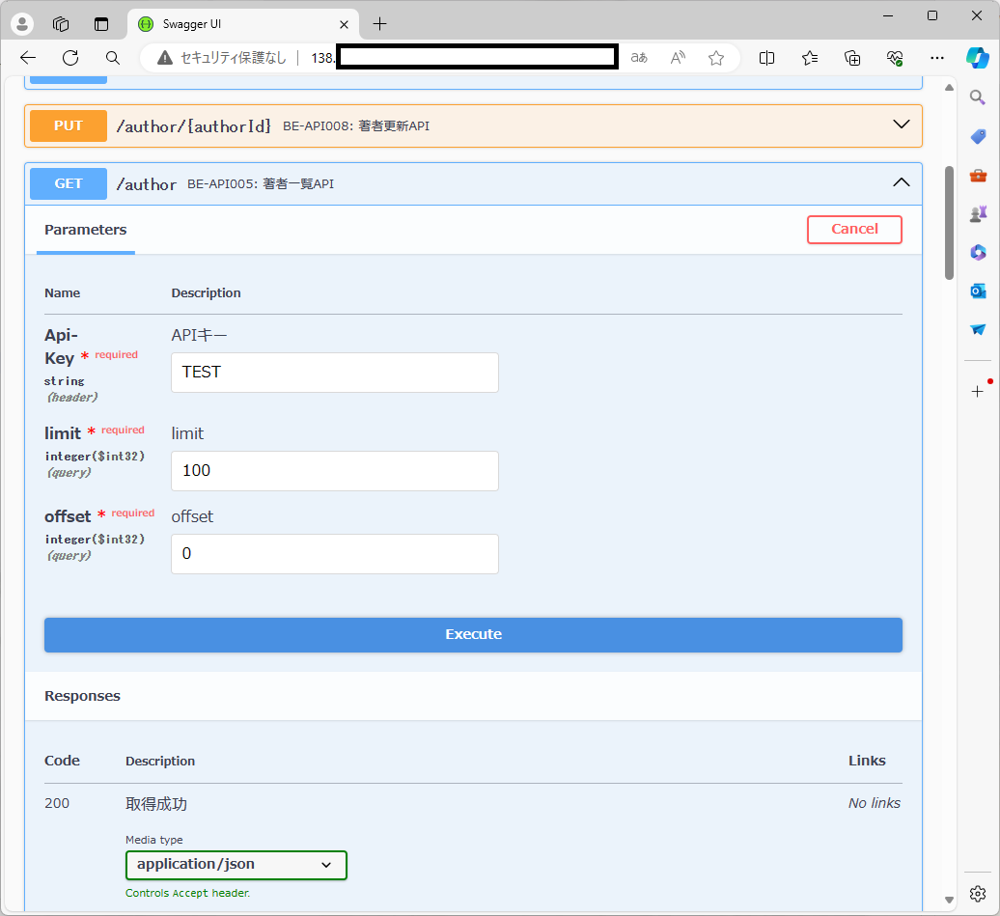
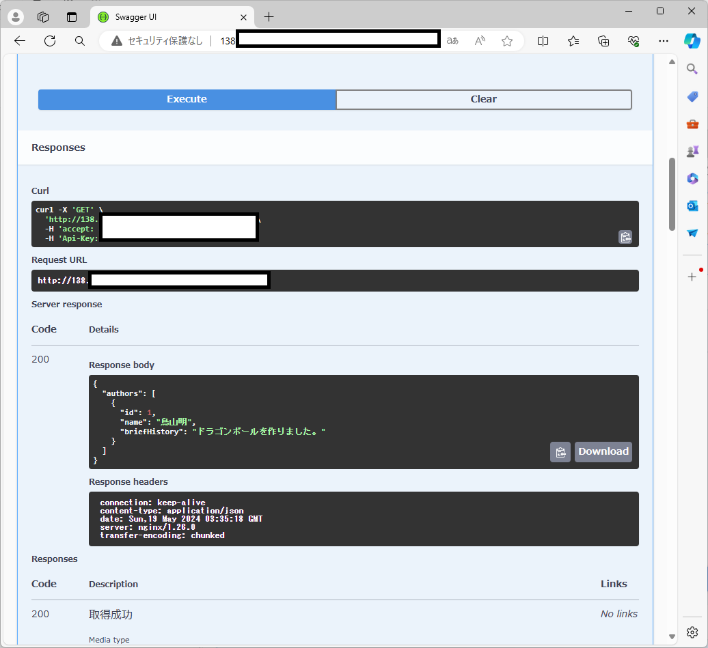

# サーバーとアプリケーションの使用方法について

## 1. ドキュメント作成者

CM) omura

## 2. 改訂履歴

- 1.0:
  - 作成日時: 2024-05-19 11:00:00
  - 更新内容: 初版作成

## 3. このドキュメントの目次

- [1. ドキュメント作成者](#1-ドキュメント作成者)
- [2. 改訂履歴](#2-改訂履歴)
- [3. このドキュメントの目次](#3-このドキュメントの目次)
- [4. このドキュメントの目的・概要](#4-このドキュメントの目的概要)
- [5. 前提条件](#5-前提条件)
- [6. サーバーの詳細](#6-サーバーの詳細)
- [7. アプリケーションの使用方法](#7-アプリケーションの使用方法)

## 4. このドキュメントの目的・概要

某企業様へお試し用サーバーへのアクセスを公開したため、アクセス方法とアプリケーションの使用方法を確認するための手順書です。 
なお、アクセス先につきましては広く公開しておりません。 
個別にご連絡いただいた方のみ、アクセス先をご連絡いたします。 

## 5. 前提条件

- 公開時期は2024年6月30日までとします。 
それ以降はアプリケーションを停止し、サーバーを撤去いたします。

## 6. サーバーの詳細

サーバーには、以下のクラウドサービスとミドルウェアを使用しています。 

#### Cloud
- [Oracle Cloud Infrastructure (OCI) Compute VMs. ](https://www.oracle.com/jp/cloud/compute/virtual-machines/)(CentOS7)
- [Oracle Cloud Infrastructure (OCI) Identity and Access Management (IAM)](https://docs.oracle.com/ja-jp/iaas/Content/Identity/getstarted/identity-domains.htm)
- [Oracle Cloud Infrastructure (OCI) Virtual Cloud Networks (VCN)](https://www.oracle.com/jp/cloud/networking/virtual-cloud-network/)

#### MiddleWare
- [Java](https://openjdk.org/projects/jdk/21/)
- [NGINX](https://www.nginx.co.jp/)
- [PostgreSQL](https://www.postgresql.org/about/press/presskit14/ja/)

## 7. アプリケーションの使用方法

1. ブラウザから連携したURLを入力し、アクセスしてください。 
ChromeやFirefox等のブラウザの指定はありません。 

2. 使用したいAPIのプルダウンを開く。

3. 「Try it outボタン」を押下し、リクエストを入力する。

4. 「Executeボタン」を押下すると、APIが実行されます。 
APIからの応答は「Server response」に記載されているので、そちらをご確認ください。 
HTTPステータスコードが2XX以外はエラー応答になります。 
4XX系はリクエスト起因のエラーです。errorMessageに従い、リクエストを修正してください。 
5XX系は想定外エラーです。応答にあるtraceNumberを連携いただければ調査いたします。 

5. 登録/更新系のAPIの正常応答は、HTTPステータスコードのみ返却しております。 
エラー応答は上述の通り、errorMessageとtraceNumberを返却しております。 
    1.使用したいAPIのプルダウンを開く。 
    
    2. 「Try it outボタン」を押下する。
    
    3. リクエストを入力する。
    
    4. 「Executeボタン」を押下する。
    
    5. 登録が成功したため、参照APIから登録されているか確認する。
    
    
    
